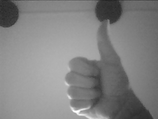

# ESP32-CAM
Arduino projects with the ESP32-CAM

## Introduction

### Prerequisites

You need
 - Hardware [ESP32-CAM](https://nl.aliexpress.com/item/1005001818136526.html)
   I would advise having an external antenna. Both my boards have trouble connection to WiFi with the on-PCB antenna.
 - The [schematics](https://github.com/SeeedDocument/forum_doc/raw/master/reg/ESP32_CAM_V1.6.pdf).
 - The ESP32-CAM does not have a USB-to-serial adapter. So either get a [stand-alone](https://nl.aliexpress.com/item/4000016600649.html) one, 
   or get a [dedicated board](https://nl.aliexpress.com/item/1005001810692306.html).
   I like the dedicated board because that has the "flash" button integrated on the PCB. This means no fiddling with buttons on every upload from Arduino.
 - Wiring instructions are [here](https://randomnerdtutorials.com/program-upload-code-esp32-cam/) - do NOT connect 5V from FTDI to 3V3 of ESP32.
 - The Espressif camera [library](https://github.com/espressif/esp32-camera/tree/master/driver).

### Getting started

The easiest way to start - assuming you have a standard board - is probably to use Arduino with the built-in camera example.
 - First chose your board, e.g. Tools > Board > ESP32 Arduino > AI Thinker ESP32-CAM.
 - Next load the example, e.g. File > Example > Examples for AI Thinker ESP32-CAM > ESP32 > camera > CameraWebServer.
 - Select the camera model at the top of the ino file in the example, e.g. `#define CAMERA_MODEL_AI_THINKER`.

## My trial projects

### Focus
You can change the focal length of the camera, by turning the cap, see [focus](focus) page.

### Harware mods
I applied [two hardware mods](hwmods): adding a low-power LED and an adapter board.
I later realized that the ESP32 has multiple [PWM channels](pwm), that you can map to any pin.
So I undid my low-power LED mod, and used PWM on the high-power LED.

### Bringup
The first project, [esp32cam-ascii](esp32cam-ascii), captures an (gray-scale QVGA) image, 
sub-samples that (5x horizontal and vertical) and renders the results as ASCII art over serial.
This is the output while waving at the camera.

### Collecting images
The second project, [esp32cam-cmd](esp32cam-cmd), consists of two parts.
The Arduino sketch captures an image and sends it to the host over USB/serial.
A [PC/Python](py-hex2png) program converts the serial dump to a png image.

There is a second [Python pogram](py-capture) that periodically sends capture commands 
to the Arduino Sketch, and automatically converts and saves the incoming bytes as an image.

## My real projects

My first real project is to use machine learning to distinguish [rock, paper, scissors](rock-paper-scissors), shot with an ESP32-CAM.
The inference is also supposed to run on the ESP32. This project is about the ESP32 firmware capturing the training images.
There is also a [machine learning project](https://github.com/maarten-pennings/MachineLearning/tree/main/rock-paper-scissors) 
to generate the model, do the training and convert it to TensorFlow Lite.

(end)
 
