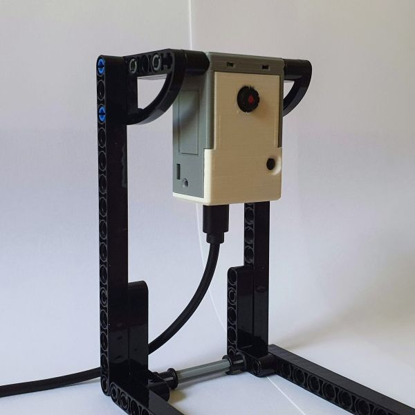

# ESP32-CAM
Arduino projects with the ESP32-CAM

## Introduction

### Prerequisites

You need
 - Hardware [ESP32-CAM](https://nl.aliexpress.com/item/1005001818136526.html)
   I would advise having an external antenna. Both my boards have trouble connection to WiFi with the on-PCB antenna.
 - The [schematics](https://github.com/SeeedDocument/forum_doc/raw/master/reg/ESP32_CAM_V1.6.pdf).
 - The ESP32-CAM does not have a USB-to-serial adapter. 
   So either get a [stand-alone](https://nl.aliexpress.com/item/4000016600649.html) one, 
   or get a dedicated board [ESP32-CAM-MB](https://nl.aliexpress.com/item/1005001810692306.html).
   I like the dedicated board because that has the "flash" button integrated on the PCB. 
   This means no more fiddling with buttons on every upload from Arduino.
   There is now even an integration of the CAM and the MB board [ESP32-CAM-CH340](https://nl.aliexpress.com/item/1005002263996143.html);
   ordered it but did not yet try.
 - Wiring instructions are [here](https://randomnerdtutorials.com/program-upload-code-esp32-cam/) - do NOT connect 5V from FTDI to 3V3 of ESP32.
 - The Espressif camera [library](https://github.com/espressif/esp32-camera/tree/master/driver).

### Getting started

The easiest way to start - assuming you have a standard board - is probably to use Arduino with the built-in camera example.
 - First chose your board, e.g. Tools > Board > ESP32 Arduino > AI Thinker ESP32-CAM.
 - Next load the example, e.g. File > Example > Examples for AI Thinker ESP32-CAM > ESP32 > camera > CameraWebServer.
 - **Important** Select the camera model at the top of the `ino` file in the example, e.g. `#define CAMERA_MODEL_AI_THINKER`.

## My experiments

### Focus
You can change the focal length of the camera, by turning the cap, see [focus](focus) page.

### Hardware mods
I applied [two hardware mods](hwmods): adding a low-power LED and an adapter board.
I later realized that the ESP32 has multiple [PWM channels](pwm) and that you can map that to any pin, also the LED pin.
So I undid my low-power LED mod, and used PWM on the high-power LED.

### Bringup
The first project, [esp32cam-ascii](esp32cam-ascii), captures an (gray-scale QVGA) image, 
sub-samples that (5x horizontal and vertical) and renders the results as ASCII art over serial.
This is the output while waving at the camera.

### Collecting images
The second project, [esp32cam-cmd](esp32cam-cmd), consists of two parts.
The Arduino sketch captures an image and sends it to the host over serial (over USB).
A [PC/Python](py-hex2png) program converts the serial dump to a png image.

There is a second [Python pogram](py-capture) that periodically sends capture commands 
to the Arduino Sketch, and automatically converts and saves the incoming bytes as an image.

Note In the mean time I no longer hex-dump an image over serial and use a Python script to convert to png.
Instead I dump the image (still text over serial) in the [pgm format](http://netpbm.sourceforge.net/doc/pgm.html) with magic number is P2.
You can copy and paste that to notepad, save it as pgm file and then open it, e.g. using [IrfanView](https://www.irfanview.com).

## My real projects

### Rock paper scissors

My first real project is to use machine learning to distinguish [rock, paper, scissors](rock-paper-scissors), shot with an ESP32-CAM.
The inference is also supposed to run on the ESP32. This ESP32-CAM side of the project

- The [training](rock-paper-scissors/esp32cam-train) sketch is about capturing the training images (with the ESP32-CAM)
- After training I had a model. The [predict](rock-paper-scissors/esp32cam-predict) sketch uses that model to film 
  a hand and make a prediction (rock/paper/scissors).

The training aspect is in a separate Python [machine learning project](https://github.com/maarten-pennings/MachineLearning/blob/main/rock-paper-scissors/rock-paper-scissors.ipynb) repo.
It does the training (based on the footage generated by the training sketch) generates the model, and convert it to TensorFlow Lite.
That is linked in the the predict sketch.

You can see the result in action in this [video](https://www.youtube.com/watch?v=dVIRe2fjQL4)

### TFLcam

In my second real project I have converted the rock-paper-scissors cam in a generic ESP32 TensorFlow Lite cam. 
It has its own [repo](https://github.com/maarten-pennings/TFLcam).
This allows one to save any (small enough) TensorFlow Lite model on an SD card, slide it in the ESP32-CAM, and get predictions over serial.
 

(end)
 
