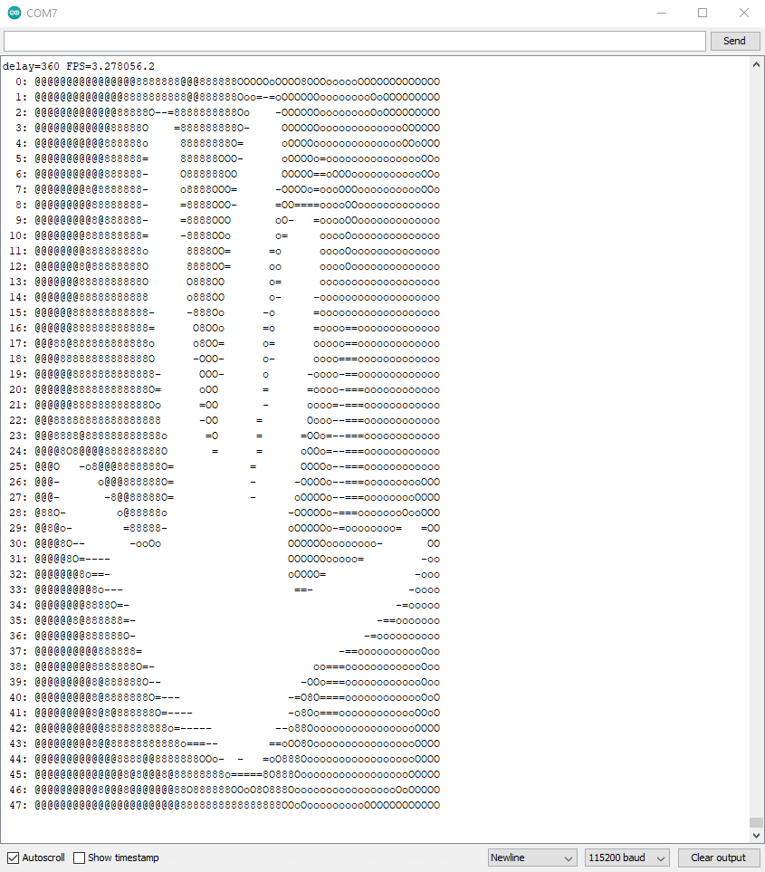

# ESP32-CAM
Arduino projects with the ESP32-CAM

## Introduction
You need
 - Hardware [ESP32-CAM](https://nl.aliexpress.com/item/1005001818136526.html)
 - Board [schematics](https://github.com/SeeedDocument/forum_doc/raw/master/reg/ESP32_CAM_V1.6.pdf)
 - Either a stand-alone [USB-Serial adapter](https://nl.aliexpress.com/item/4000016600649.html), 
   or a [dedicated board](https://nl.aliexpress.com/item/1005001810692306.html)
 - Wiring instructions are [here](https://randomnerdtutorials.com/program-upload-code-esp32-cam/)
 - Using the espressif [library](https://github.com/espressif/esp32-camera/tree/master/driver)

## Projects
At this moment, there is one project, [esp32cam-ascii](esp32cam-ascii), that captures an (grayscale QVGA) image, 
subsamples that (5x horizontal and vertical) and renders the results as ASCII art. 
This is the output while waving at the camera.

(end)
 
