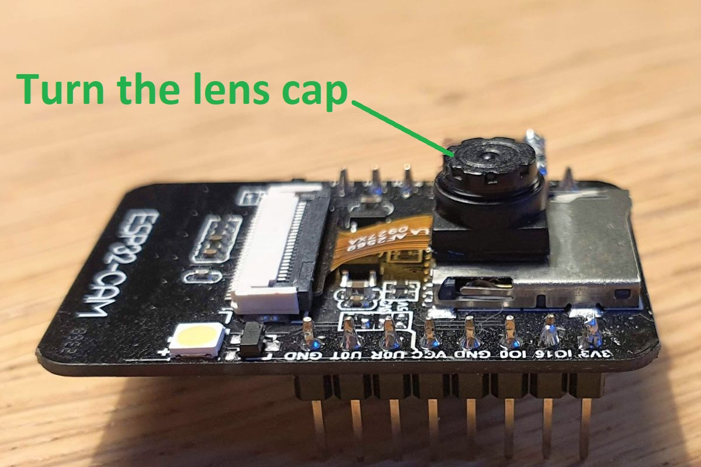
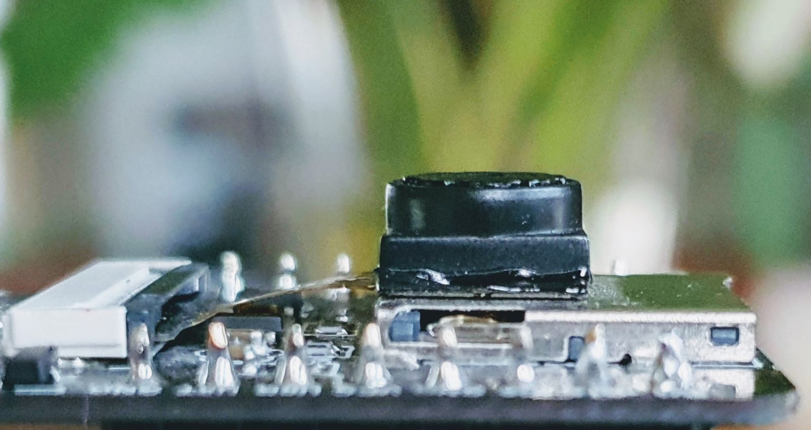
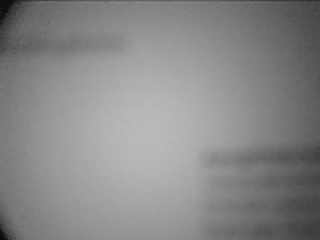
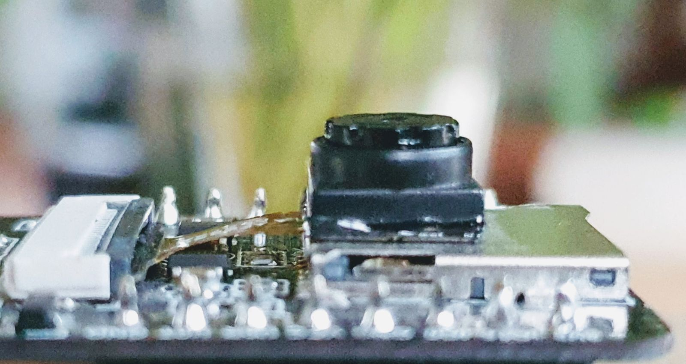

# Focus

Changing the focal point of the OV2640.

# Introduction

The ESP32-CAM board comes with the Omnivision OV2640 camera chip.
You can find a [datasheet](http://www.uctronics.com/download/OV2640_DS.pdf) for the chip, but that is only the chip.
The chip is packaged in a plastic case, and the case has a cap, which contains the lens.
By turning the cap, the lens goes up or down, and this changes focal length.

In my case, there was some debris (?) between the case and the cap, so in the beginning it was hard to turn the cap.
It is possible to completely unscrew the cap. You can then see the bare image sensor. It would recommend to close it quickly.

# Lens in
If you turn the cap clock-wise, the lens moves down/inwards.

I made a photo of a tax letter ~15cm away from the lens.

# Lens out
If you turn the cap anti-clock-wise, the lens moves up/outwards.

I made a photo of a tax letter ~15cm away from the lens.

(end)
