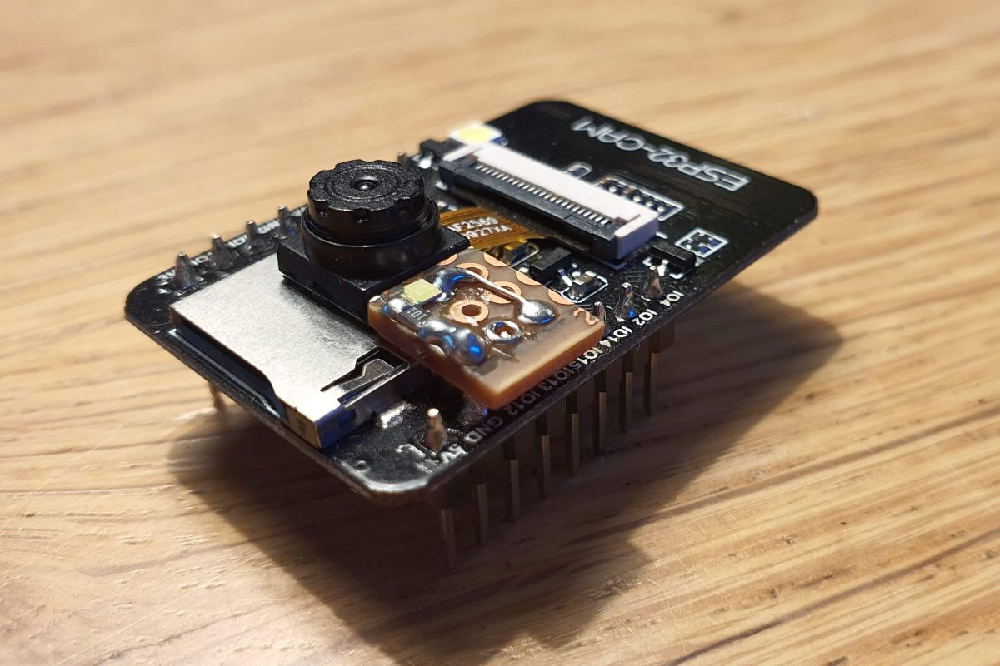
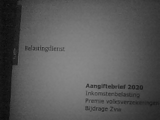
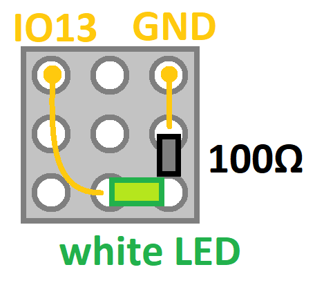
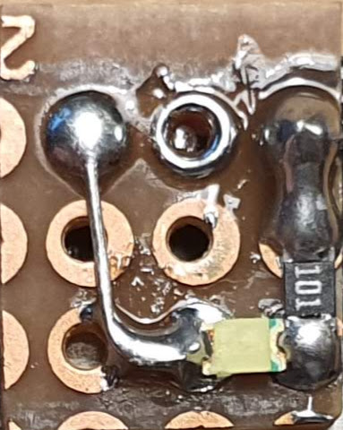
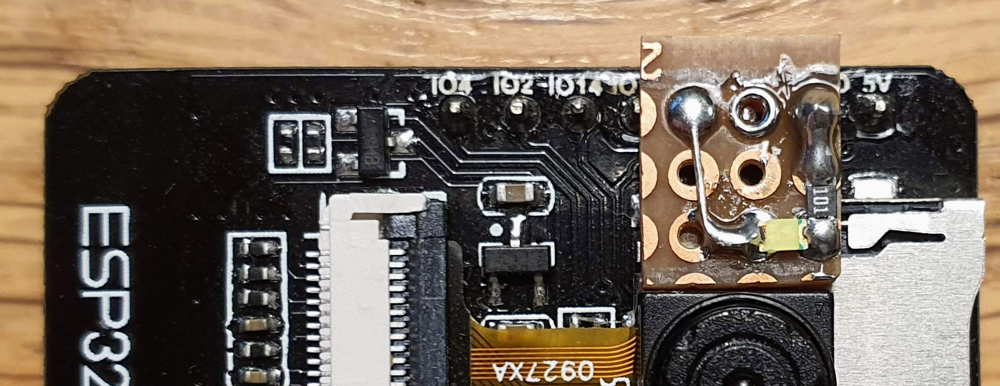
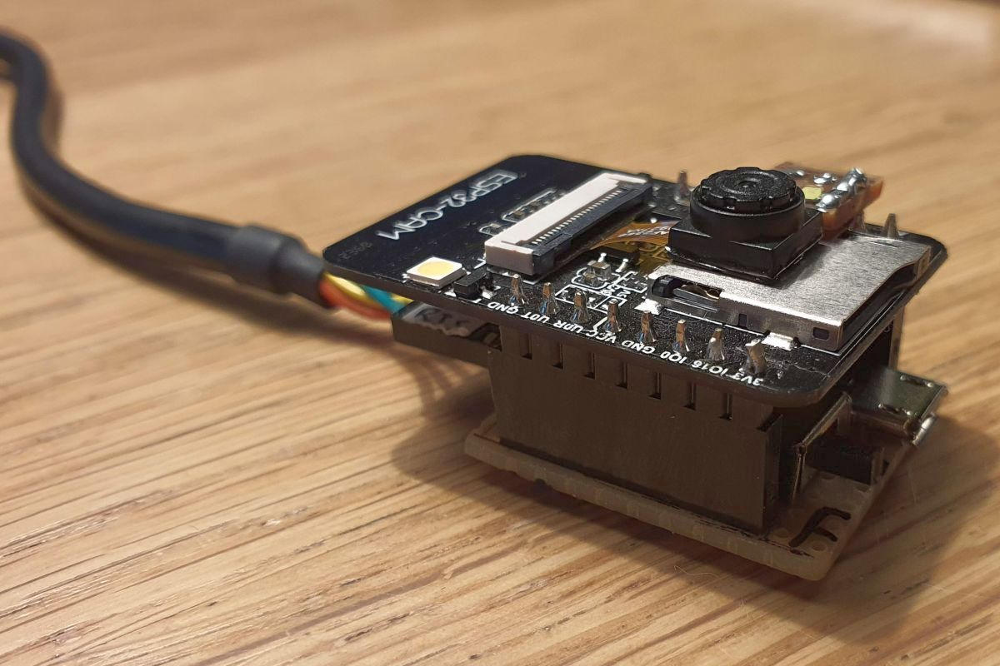
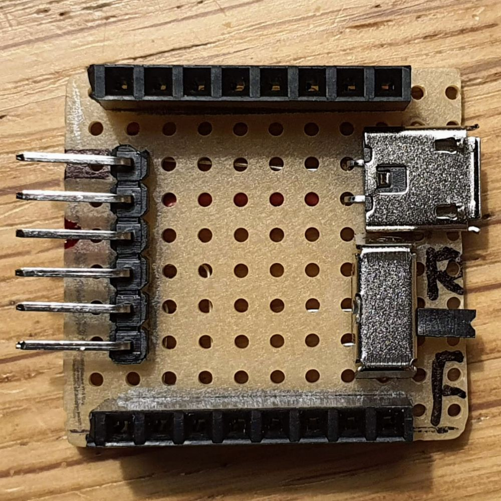
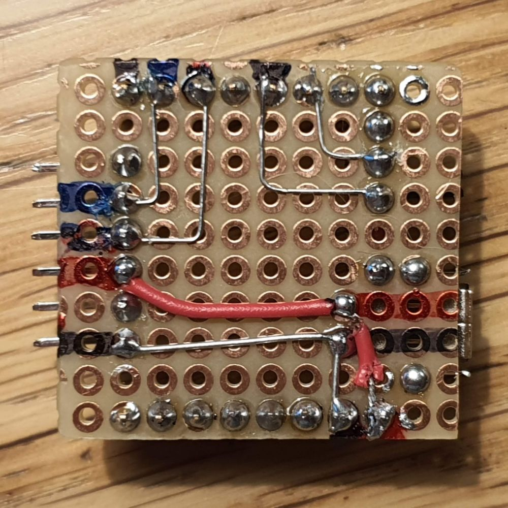
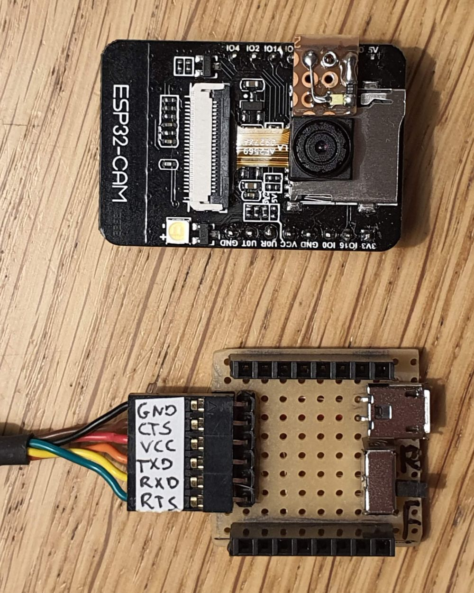

# Hardware modifications

Modifications to the ESP32-CAM board.

## Low-power flash LED

I added a low-power led to illuminate the scene ("flash" light).

### Problem of the existing flash LED

The ESP32-CAM comes with a high-power white LED.
It is so powerfull that it completely washes out all texture.

This is an example of photo of a letter at ~15cm, using the high-power LED (Flash LED 2).

I decided to add a second, low-power LED. Here is the same photo using the low-power LED (Flash LED 1).

### Schematic

I decided to hook a low-power white LED to IO13.
The forward voltage over the LED is Vf = 2.6V.
This means that the voltage over the current limiting resistor is Vr = 3.3 - 2.6 = 0.7V.
I used a resistor of 100Ω, which means the current is I = V/R = 0.7/100 = 7mA.
A resistor of 50Ω would have been better, but I didn't have one.

Note that the LED is high active (IO13 means LED is on).

### Board

This is a photo of the board for Flash LED 1.

Here we see it mounted on the ESP32-CAM, connecting it to IO13 and GND.

### PWM

I later realized that the ESP32 has multiple [PWM channels](../pwm), that you can map to any pin.
That's much easier, so I undid my low-power LED mod.

## Adapter board

The ESP32-CAM is hard to program. You need an FTDI (USB to serial) cable.
And you need to have GPIO-0 grounded on reset to get the board in flash mode.
I decided to make an adapter board.

### Schematic

Features
- two 8-pin header for the ESP32-CAM
- 6-pin header for an FTDI cable
- micro-USB plug (power only)
- switch to select run/flash after boot

Note that the FTDI header and the USB are connected, so do not wire them simultaneously.

### Board

This is a photo of the adapter board.

And the wiring at the back.

Here two overview photos

(end)