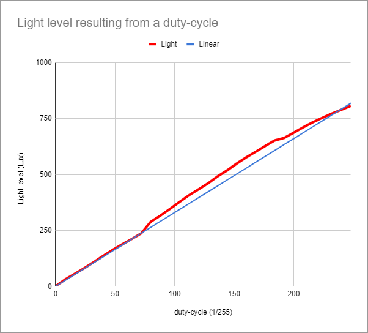

# PWM

Using PWM for the flash LED.

## Introduction

The ESP32-CAM comes with an on-board high-power LED to illuminate the scene (a "flash").
However the LED is so powerfull that it completely washes out all texture, see [hardware fix](../hwmods) for washed-out images.
My first solution was to add a low-power LED, a [hardware mod](../hwmods).
Later I realized that the ESP32 has a flexible PWM block. 
This page describes my experiments using this PWM block.
The experiments were successful, so I removed the low-power LED hw-mod.

## PWM

The ESP32 has a hardware block the generates square waves of a given frequency and duty cycle.
This block has 16 channels, and those channels can be mapped to "any" GPIO pin.
I would be tempted to call the block "pwm" (pulse width modulation), but Arduino/ESP32 refers to it
as "ledc" (presumably "led control").

The setup is as follows

```
  ledcSetup(CHANNEL, FREQUENCY, RESOLUTION); // Setup a PWM channel
  ledcAttachPin(PIN, CHANNEL);               // Attach the PWM channel to the (LED) pin
  ledcWrite(CHANNEL, DUTY);                  // Change duty cycle of the PWM channel
```

See [pwm.ino](pwm.ino) for a simple sketch that PWMs the high-power LED of the ESP32-CAM board.

## Calibration

My eyes could see the differences between steps in the lower duty cycles, but not for the steps between high duty cycles.
I decided to measure instead of relying on my eyes. 

I downloaded the app [photometer](https://play.google.com/store/apps/details?id=com.pardel.photometer).
It uses a sensor in an Android phone to measure the light level.
I used the above [pwm.ino](pwm.ino) sketch to generate 32 duty cycle settings,
and used the app to measure the achieved light level.

I made one rooky mistake: my first measurements failed because I assumed the light level meter is at the back of the mobile phone.
It isn't, it is at the front - it is used to change the brightness of the screen, not to set the shutter of the world facing camera.

The table below shows (first column) the duty-levels I selected - as generated by [pwm.ino](pwm.ino) -
and the light levels reported by the app (second column). 

  | duty-cycle | Light | Linear |
  |:----------:|:-----:|:-------|
  |       0    |    1  |     0  |
  |       8    |   31  |    26  |
  |      16    |   56  |    53  |
  |      24    |   81  |    79  |
  |      32    |  108  |   106  |
  |      40    |  136  |   132  |
  |      48    |  163  |   158  |
  |      56    |  188  |   185  |
  |      64    |  212  |   211  |
  |      72    |  237  |   238  |
  |      80    |  289  |   264  |
  |      88    |  316  |   290  |
  |      96    |  346  |   317  |
  |     104    |  377  |   343  |
  |     112    |  407  |   370  |
  |     120    |  433  |   396  |
  |     128    |  460  |   422  |
  |     136    |  491  |   449  |
  |     144    |  518  |   475  |
  |     152    |  548  |   502  |
  |     160    |  576  |   528  |
  |     168    |  601  |   554  |
  |     176    |  627  |   581  |
  |     184    |  652  |   607  |
  |     192    |  663  |   634  |
  |     200    |  687  |   660  |
  |     208    |  711  |   686  |
  |     216    |  733  |   713  |
  |     224    |  753  |   739  |
  |     232    |  772  |   766  |
  |     240    |  789  |   792  |
  |     248    |  807  |   818  |

The third column shows a straight "fitted" line. 
That makes sense, because as the below graph shows, the light-level is linear with the PWM.



## Set back

Of course, after integrating the PWM with the camera app, the camera app no longer worked.
I got this error
```
[E][camera.c:495] i2s_run(): Timeout waiting for VSYNC
```

My suspicion was that the camera uses PWM itself.
And indeed, my "own" [source]("../esp32cam-cmd/cammodel.h") has the following line, 
hinting the camera uses PWM ("led control") channel 0.
```
  .ledc_channel   = LEDC_CHANNEL_0,
```

Using channel 0 for the LED flash conflicts with that.
After changing the channel from 0 to 15 for the flash LED, all seems fine.


## Conclusion

We do not need the hardware mod for a low-power LED.
The PWM on the high-power LED is more than adequate.

(doc)
