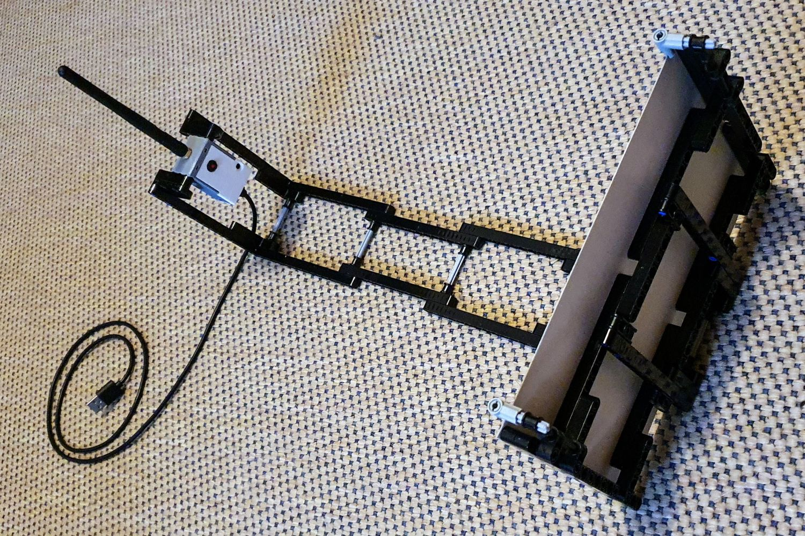

# Rock paper, scissors

My first real project with the ESP32-CAM is to use machine learning to distinguish rock, paper, scissors (and none) shot with an ESP32-CAM.
The inference is also supposed to run on the ESP32.

At this moment I completed
 - A photo rig. I first made an enclosure for the ESP32-CAM to match Lego Mindstorms Robot Inventor.
   
   
 - Since it does not use WiFi, here is a close-up without the antenna.
   
 
 - A ESP32 sketch [esp32cam-train.ino](esp32cam-train) that on a key press (CR over serial) takes a photo, 
   crops a fixed region, averages a block of 4x4 pixels into one, performs a histogram equalization
   and dumps the pixels values over serial (in hex and as ASCII art).
   ```text
     0: 8d92a1aeb9bec7d0d8dde2e5e7e9ebedf2f5f5f6f8f8fbf8f6fbf8f5f2edebe9e6e5e2dfdcd5cbc7c1b9b1aaa1d8 |oo====----                         ------====-|
     1: 909ba1b3bbc5cbd3dcdfe3e6eaeaedf0f2f5f8fbfbfbfdfdfbfbf6f2f0f0edeae7e6e2e2ddd8d3cbc5bbb6aaa6d8 |oo===-----                          -----====-|
     2: 909ba6b6bec5d0d5dde0e3e6e9ebedf2f5f6f8fbfbfdfefdfdfbfbf5f2f0edebe9e7e5e0dfdcd5d0c5beb3aea6dc |oo===----                           -----====-|
     3: 929daab6c1c7d3dcdfe2e5e7eaedf0f2f5f8fbfdfdfefefefdfbf8f5f5f2f0ebe9e7e5e2dddcd8d0c1c1b6aea6d8 |oo==-----                           ------===-|
     4: 97a1aab6c5cbd5dcddc1aea197b6d8e9f8fffffffefdfdfbf8f5f5f5f2f0edebe9e7e5e0dfdcd5d0c5beb3aea6d8 |o===------==o=-                     -----====-|
     5: 97a6aeb9c5d0d5dda65b505c7a9bbeb9cbd8dcc1b6ddfffdf6f5f2f0f0f0edeae9e6e3e2dfdcd3cbc5beb3aeaad3 |o===----=888Oo==----=-              -----====-|
     6: 97a1aebbc5d0d5dc5b272434424d4d54545856a1ddd39287cbf8f8f5f2f0edeae7e6e3e0dddcd3cbc5bbb3a6a671 |o===----8@@@8888888=--oo-           -----====O|
     7: 97a1aeb9c1cbd3d38a191b232d323f453e474b566265678aaa9db19d978ab1f0eae5e2dfdcd8d0c7c1bbb1a69dbe |o===----oWW@@@@8@888OOOo=o=ooo=    ------===o=|
     8: 97a1aeb6c1c7d0d0d0be7345231f2c34343039495c62625e586070a6a6e3be76678ae2e0dcd5cbc7beb9aea19bcb |o===-----=O8@W@@@@@88OO88OO== =OOo  ----====o-|
     9: 979daab6bec5cbd0d0cbd0d5e0e0ae6a4219283a495158544b5450575c6b6ab9c7aa6267c5d5cbc1b9b1aaa19768 |oo===-------  =O8W@@888888888OO=-=OO----====oO|
    10: 909baab6bec1c7d0d3d8dcd8d8d8d8d3d8df90392c393e3b424d4d4d4b50507a7aaaaa73545b97c5bbb1a69d9776 |oo===-------------o@@@@@8888888OO==O88o-===ooO|
    11: 9097a6b1bbbeb66d655e60657676736a5e60626a4d50514256574744474750545e8db38a766a5b454760839b9b39 |oo=====OO8OOOOOO8OOO8888888888888o=oOO888Oooo@|
    12: 8d979db1b9b1161c1f273b2c302d32322c2c2d271b1210214960584b39454b3d70c5c18d736d70737a5e3f426b3a |ooo===WWW@@@@@@@@@@@WWW@8O88@88@O--oOOOOO8@8O@|
    13: 8d979daab15e120f161f322c364447453e445650443028291e34565732504b90f0dc9b7363514b5049443d3f362d |ooo==8WWWW@@@888@8888@@@W@88@88o -oOO88888@@@@|
    14: 879097a6aa8a0f0c141a1e1e282d3a34363e4d50493d3939393915231a5bc1be977d5b4b4232293034301f1e2730 |ooo==oWWWWWW@@@@@@888@@@@@W@W8-=oO888@@@@@WW@@|
    15: 808d92a1aaa69268575145442c2324271a242c343a3d303636301e1c87dfb3656370573d3229282c272717130e0c |ooo===oO8888@@@@W@@@@@@@@@WWo-=OOO8@@@@@@@WWWW|
    16: 8087909ba1a6a6aaaeaeb6c1d3cbcbd3d08780ae6714292824398dd5b9765b63686b62453b343434363019130e06 |oooo=======------oo=OW@@@@o-=O8OOOO8@@@@@@WWWW|
    17: 7a7d87909ba6aaaeb6b6becbd0cbc7cbc7cbc7d33e4239546b7a675b565662686354504b444742423f361e150f09 |OOooo======---------@8@8OOO888OOO8888888@@WWWW|
    18: 717a838a929ba1aeb3b9bbc5d3d3cbd3d0d0aa233050a68357503a495b5c605c504942445b5450493d2c2117130f |OOoooo=====-------=@@8=o88@888O888888888@@@WWW|
    19: 70767d878d929ba1aeb1b6c1d0d0c5c7c7c77daeb17d545445393f4d504d423a32323f5751544b3b2c1e1a120c0f |OOOoooo====-------O==O888@@8888@@@@8888@@WWWWW|
    20: 6b717a808a90929da1a6aeb3c5c5bbb9b9ae6776605e3e4d4b3b3d39301c191713213030362c2d241b150c070e0a |OOOooooo====--====OOO8@88@@@@WWWW@@@@@@@WWWWWW|
    21: 6870737d838a8d929ba1a6a6b3c1b3aeae8d547a673d3947423221121a3b5b5b27090c1216191716100909150d0c |OOOOooooo====-===o8OO@@88@@WW@88@WWWWWWWWWWWWW|
    22: 65686d767d80878a929b9b9da1b9b19b9d9b5c28241e16100c0a192c2d4251492309050c1009060405070c0d0a07 |OOOOOooooooo===ooo8@@WWWWWW@@888@WWWWWWWWWWWWW|
    23: 62676d71737d83878d92929292aea69ba19797766760626d9d232724282d28230e101e211e23241e191712130a0c |OOOOOOooooooo==o=ooOOOOOo@@@@@@@WWW@W@@WWWWWWW|
    24: 6265676d70767a80878d90908a979790aa9b8a8a87878780766d090c1204071a2721293d3b241f1f19140d0c0509 |OOOOOOOooooooooo=oooooooOOWWWWWW@@@@@@WWWWWWWW|
    25: 5e6065686b70738083878a8a83838787a19787838787877d76706d473a03060f151c24271b1b191412100a050302 |8OOOOOOooooooooo=ooooooOOOO8@WWWWW@@WWWWWWWWWW|
    26: 575c60656a6d70767a808383807a7d7d9b9b83808083837d7a736d6b7a764b390201010205070506060403010101 |88OOOOOOOooooOOOoooooooOOOOOOO8@WWWWWWWWWWWWWW|
    27: 54575b60656a6d70717a80807d7a767a909b807d808083807d7d767a7d706a6a020000000003231612140e070503 |888OOOOOOOooOOOOoooOooooOOOOOOOOWWWWWW@WWWWWWW|
   1>> 
   ```   
 - For each of the classes (rock, paper, scissors and none) I have shot 100 photos (top later train a neural net), 
   and saved the serial output to a log file. They are saved in the [logs](logs) directory.
 - There is a python script [hexs2pngs](hexs2pngs) that converts those logs to a series of png images.
 - The images are stored in [data](data).
   
   
   
 - A convolutional neural net (CNN) as a separate [ML](https://github.com/maarten-pennings/MachineLearning/tree/main/rock-paper-scissors) github project.
 - Port the CNN to TensorFlow **Lite**, same [github project](https://github.com/maarten-pennings/MachineLearning/tree/main/rock-paper-scissors).
 - Port it to TensorFlow Lite for the **ESP32 micro-controller**, using [EloquentTinyML](https://github.com/eloquentarduino/EloquentTinyML]. 
   See the [test set](https://github.com/maarten-pennings/MachineLearning/tree/main/rock-paper-scissors/rps32), again in the same github project.
 - A self-contained ESP32 [sketch](esp32cam-predict) that predict the hand pose.
 - An even fancier version is the [TFLcam](https://github.com/maarten-pennings/TFLcam) in a separate repo.
   This allows one to save the model on an SD card, slide it in the ESP32-CAM, and get predictions over serial.

(end)

